# AI Image generation for non-savvy people

With Krita and AI Diffusion Plugin

15.05.2024

---

## Check-in question

What kind of image processing software are YOU using?

---

## What is Stable Diffusion?

Everyone knows Stable Diffusion indirectly.

Whenever you generate images using a text prompt, a Stable Diffusion Algorithm is being used.

https://poloclub.github.io/diffusion-explainer/

... but today is not about Stable Diffusion.

---

## Concerns with online image generation

The user can only control *the Prompt*.

He has no control on:

* Checkpoint Model (AI Model) to use
* Resolution
* Training

Also there are concerns about privacy, source data, copyright...

---

## Comfy UI makes life easier

Allows you to control the image generation with Stable Diffusion more precisely:

* Select Base Model
* Select Input data
* Allows for Text2Img, Img2Img...
* and much more - using a node graph.

---

## DEMO Comfy UI

http://10.23.23.2:8188

---

## But still...

... it's not really convenient for digital artists.

---

## Krita Stable Diffusion Plugin to the rescue!

Stable Diffusion directly integrated in an image editor

https://github.com/Acly/krita-ai-diffusion

---

## What's Krita?

* Adobe Photoshop inspired
* Open Source

---

## Features

* Very easy installation
* Works Out-of-the-box:
  * Installs Comfy UI with everything included
  * Works with CPU or GPU (or GPUaaS)

Requirements for local generation:

* NVidia GPU, at least 8GB VRam (depending on BaseModel)

There is a CPU fallback, but takes 10x longer to render

---

## Installation

Take this link:

`https://github.com/Acly/krita-ai-diffusion/releases/download/v1.17.1/krita_ai_diffusion-1.17.1.zip`

And paste it into Krita:

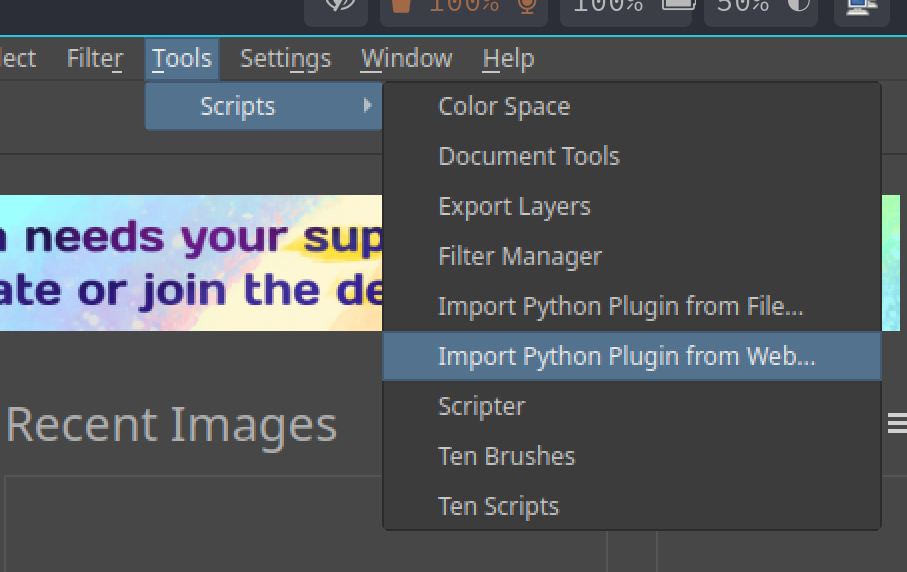

---

## Enable Plugin

1. Restart Krita
2. Enable Plugin

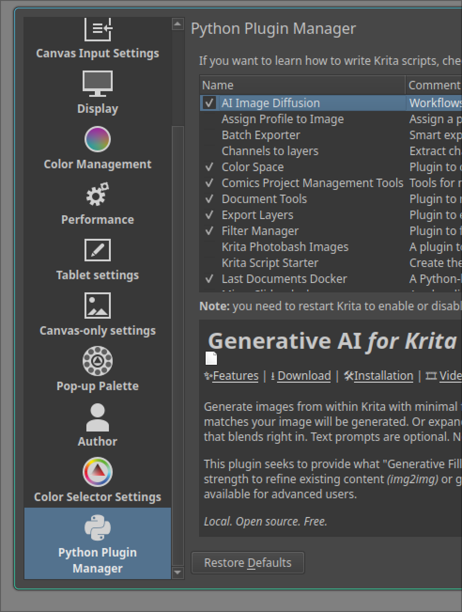

---

## Add AI Generation Docket

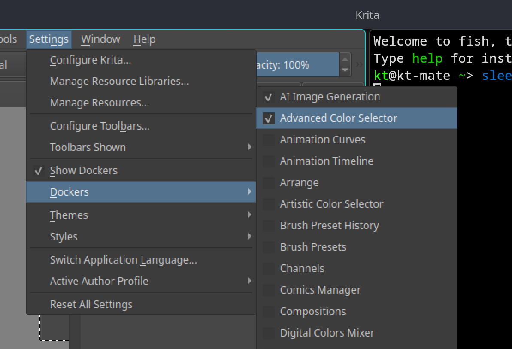

---

## Inpainting DEMO: Image generation / composition with (negative) prompts

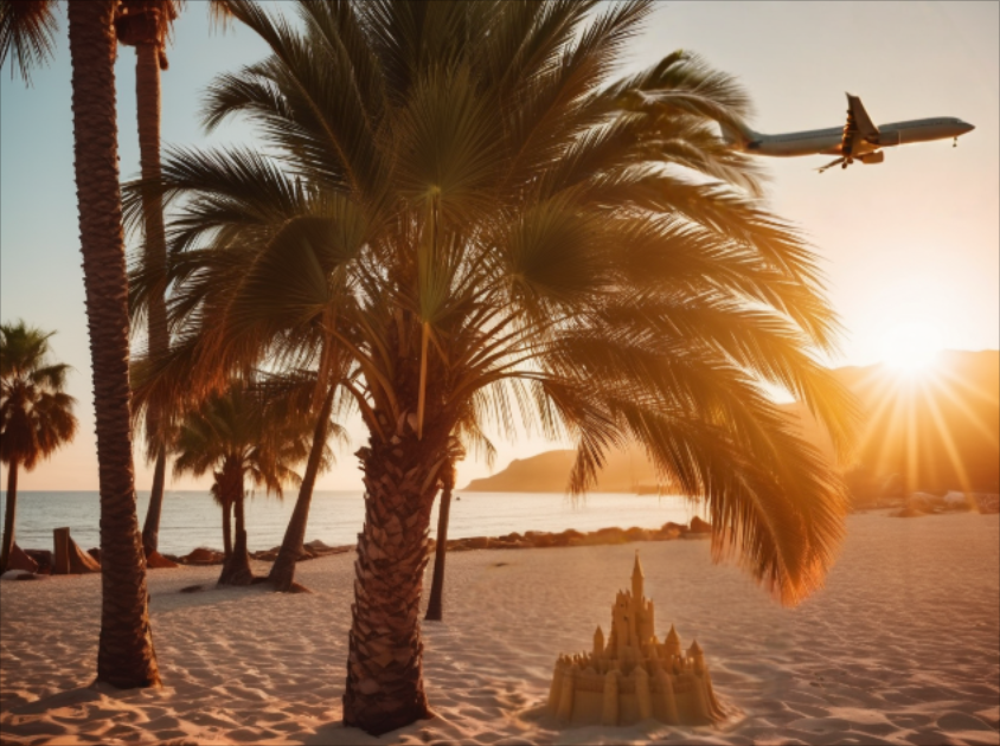

<small>
Example prompt: `Summer beach, palms, sunset, lens flare`
Negative prompt: `people, clouds`
</small>

---

## Image references DEMO: With MY face

Add your face on generated images.

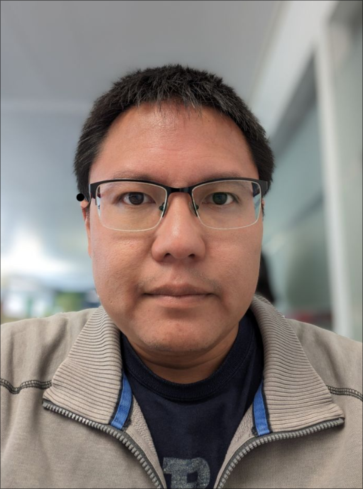 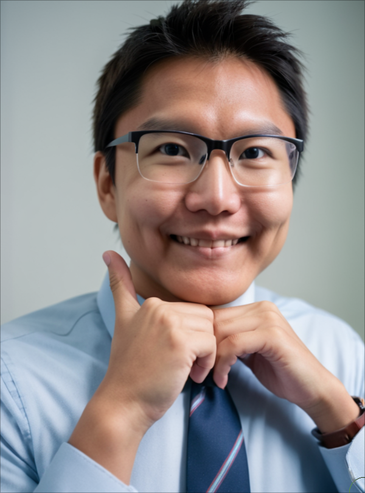

<small>
Face reference
Prompt: portrait, necktie, smiling, hands on chin
</small>

---

## Outpainting DEMO

Enlarge a picture (Iguazu Falls)

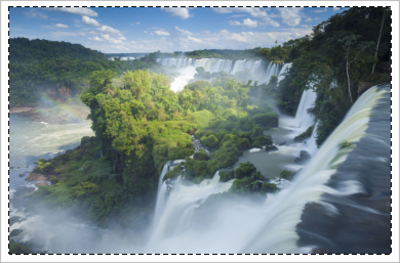 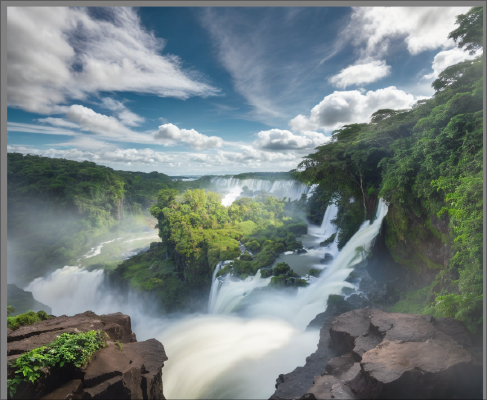

Text prompt: `waterfalls, jungle, sky, clouds`

---

## Digital Artwork DEMO: A fantasy oktoberfest

Text prompt: `rabbit with beer in hand, oktoberfest`

Change some things in picture

---

## Digital Artwork DEMO: Poses

* Text prompt: `jumping princess, crown`

---

## Upscaling DEMO: Navy-CIS "Computer Enhance"

Usually used to upscale generated images to a higher resolution.

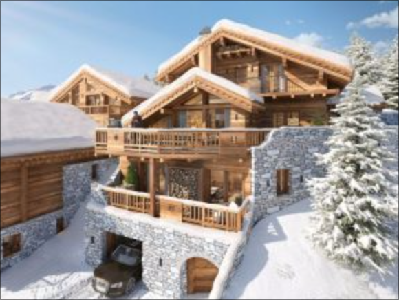 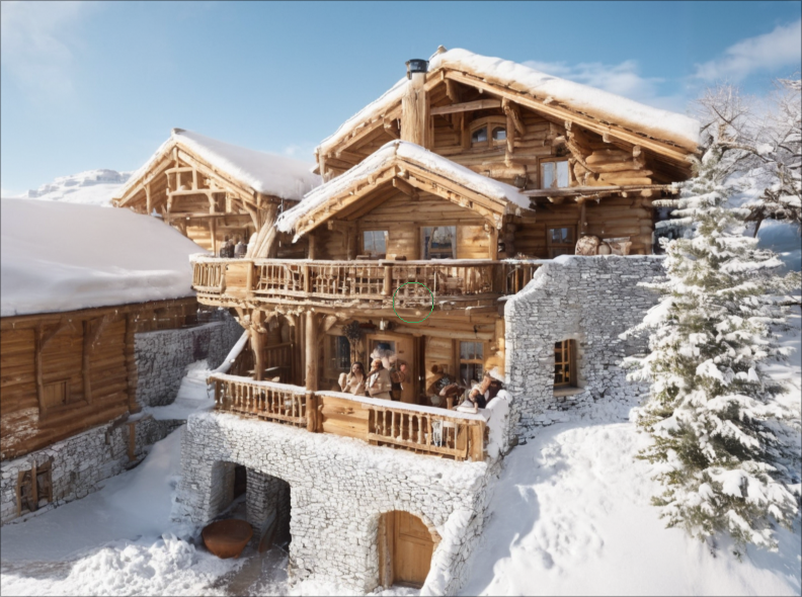

---

## Some glossary

* Model Checkpoint: Trained Stable Diffusion Base Model

Checkpoint Models are trained to output specific styles (usually: 4-10 GB)

* LoRA: Low Rank Adaptations

Adapt a Checkpoint Model with additional data (usually 50MB - 200 MB)

* VAE: Variable Auto Encoder

Already part of Model Checkpoint. Controls Color and Sharpness of the output image.
You might want to use a custom VAE

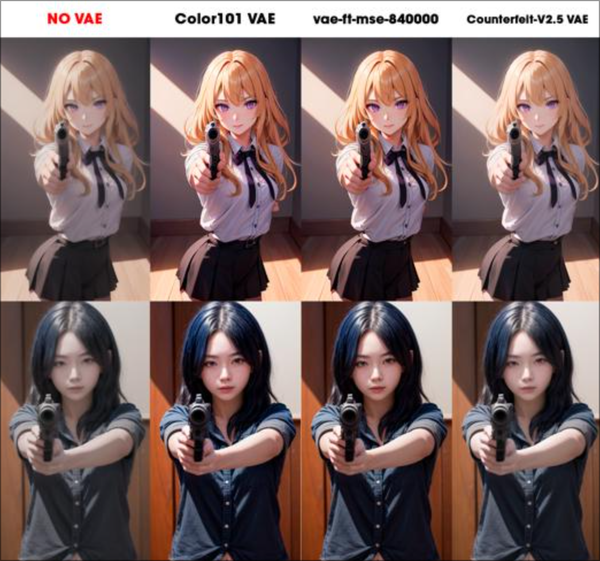

---

## In-Depth Topic: Krita Diffusion Plugin settings

---

## In-Depth Topic: Stable Diffusion Models

I want to use a specific Stable Diffusion Model!

Train them yourself or get them from

https://civitai.com/models

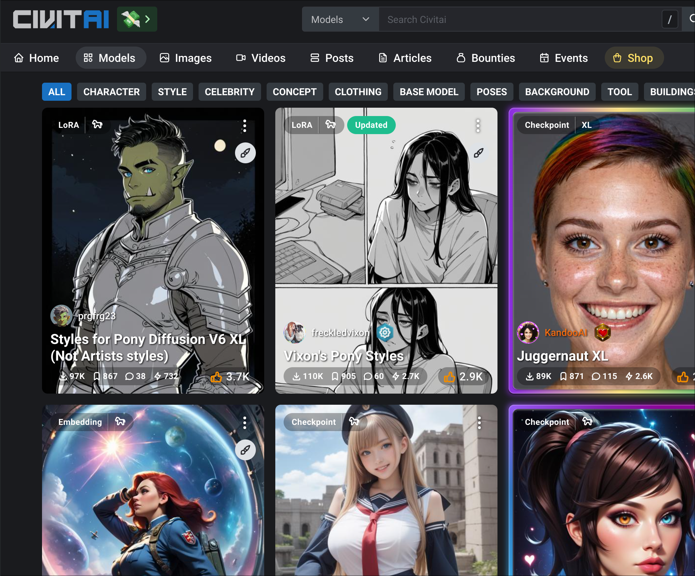

---

## My Setup & Questions

* CPU: AMD Ryzen 7900X
* GPU: NVidia
* Tablet: iPad Air 2020 w/ Apple Pencil
* Connected using Weylus 